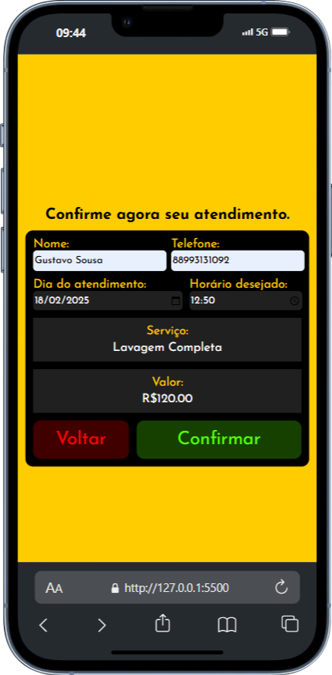
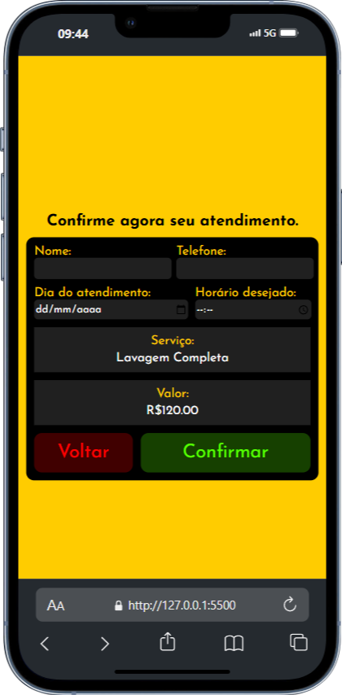

# 🧼 delttaDetailer

O **deltaDetailer** é um catálogo web mobile para estética automotiva com funcionalidade de agendamento. O sistema permite aos usuários explorar serviços de estética e agendar horários.

## 📋 Índice

- [Descrição do Projeto](#descrição-do-projeto)
- [Funcionalidades](#funcionalidades)
- [Tecnologias Utilizadas](#tecnologias-utilizadas)
- [Como Usar](#como-usar)
- [Endpoints da API](#endpoints-da-api)
- [Estrutura do Banco de Dados](#estrutura-do-banco-de-dados)
- [Como Executar o Projeto Localmente](#como-executar-o-projeto-localmente)
- [Contribuição](#contribuição)
- [Licença](#licença)
- [Contato](#contato)

## 📌 Descrição do Projeto

O **deltaDetailer** é uma plataforma online para estética automotiva, onde os usuários podem explorar diferentes serviços de cuidados para veículos e agendar horários para os serviços desejados.

## 🫡 Funcionalidades

- **Exploração de Serviços**: Navegue entre os serviços de estética automotiva, como polimento, vitrificação, higienização, etc.
- **Agendamento de Horários**: Permite ao usuário agendar um horário para a realização do serviço.

## 🔧 Tecnologias Utilizadas

- **Frontend**:
  - HTML5, CSS3, JavaScript
- **Backend**:
  - Spring Boot (Kotlin)
  - PostgreSQL

## 💪 Como Usar

1. Explore os serviços disponíveis no catálogo.
2. Escolha o serviço desejado e clique em agendar.
3. Selecione a data e hora desejadas para o agendamento.
4. Confirme o agendamento e forneça os dados de contato necessários.

## 🌐 Endpoints da API

### 1. **Obter Catalogo de Serviços**
**Endpoint:** `GET /services`

**Exemplo de Requisição:**
```http
GET /services
```

**Exemplo de Resposta (200):**
```json
[
  {
    "id": 1,
    "name": "Lavagem Completa",
    "description": "Lavagem externa e interna do veículo, incluindo enceramento.",
    "price": 120,
    "imglink": "source/assets/lavagemcompleta.jpg"
  },
  {
    "id": 2,
    "name": "Polimento",
    "description": "Remoção de riscos leves e realce do brilho da pintura.",
    "price": 250,
    "imglink": "source/assets/polimento.jpg"
  },
  {
    "id": 4,
    "name": "Cristalização de Pintura",
    "description": "Proteção extra para a pintura contra sujeira e raios UV.",
    "price": 300,
    "imglink": "source/assets/cristalizacaopintura.jpg"
  },
  {
    "id": 5,
    "name": "Vitrificação de Vidros",
    "description": "Aplicação de repelente de água para maior visibilidade na chuva.",
    "price": 150,
    "imglink": "source/assets/vitrificacaovidros.jpg"
  },
  {
    "id": 6,
    "name": "Enceramento",
    "description": "Proteção da pintura com cera especial.",
    "price": 100,
    "imglink": "source/assets/enceramento.png"
  },
  {
    "id": 8,
    "name": "Hidratação de Couro",
    "description": "Tratamento especial para bancos e revestimentos de couro.",
    "price": 160,
    "imglink": "source/assets/hidratacaocouro.jpg"
  },
  {
    "id": 3,
    "name": "Higienização Interna",
    "description": "Limpeza detalhada de bancos, carpetes e painéis.",
    "price": 180,
    "imglink": "source/assets/higieneinterna.png"
  },
  {
    "id": 7,
    "name": "Revitalização de Plásticos",
    "description": "Hidratação e proteção dos plásticos internos e externos.",
    "price": 90,
    "imglink": "source/assets/revitalizarplasticos.jpg"
  }
]
```

### 2. **Agendar Serviço**
**Endpoint:** `POST /appointments`

**Parâmetros de Consulta:**
- `id` (obrigatório): Id do serviço.

**Exemplo de Requisição:**
```http
POST /appointments?id=1
```

## 📸 Screenshots - (Clique nas imagens para amplia-las)

<div class="desktop">
  
  
  
</div>

## 🗄️ Estrutura do Banco de Dados

### Tabelas

#### 1. **Tabela `services`**
Armazena os tipos de serviços disponíveis.

```sql
CREATE TABLE services (
    id SERIAL PRIMARY KEY,
    name VARCHAR,
    description TEXT,
    price REAL,
    duration VARCHAR
);
```

#### 2. **Tabela `appointments`**
Armazena os agendamentos realizados.

```sql
CREATE TABLE appointments (
    id SERIAL PRIMARY KEY,
    service_id INTEGER,
    user_id INTEGER,
    appointment_date TIMESTAMP,
    FOREIGN KEY (service_id) REFERENCES services (id)
);
```

## 💽 Como Executar o Projeto Localmente

1. Clone este repositório:
   ```bash
    git clone https://github.com/gustavodeltta/deltaDetailer.git
   ```
2. Navegue até o diretório do projeto:
   ```bash
   cd deltaDetailer
   ```
3. Configure o backend:
   - Certifique-se de que o PostgreSQL está instalado e configurado.
   - Atualize as credenciais no `application.properties`.
   - Execute o backend usando um IDE ou o comando:
     ```bash
     ./gradlew bootRun
     ```
4. Inicie o frontend abrindo o arquivo `index.html` em um navegador.

## 🖇️ Contribuição

Contribuições são bem-vindas! Se você deseja colaborar com este projeto:

1. Fork este repositório.
2. Crie uma nova branch (`git checkout -b feature/MinhaNovaFuncionalidade`).
3. Realize suas alterações e faça commit (`git commit -m 'Adiciona uma nova funcionalidade'`).
4. Envie a branch para o repositório remoto (`git push origin feature/MinhaNovaFuncionalidade`).
5. Abra um Pull Request.

## 📄 Licença

Este projeto não possui uma licença definida. Sinta-se livre para utilizar e modificar o código conforme necessário.

## 📩 Contato

Para dúvidas ou sugestões, entre em contato:

- **Nome**: Gustavo Sousa
- **Email**: [deltta.dev@gmail.com](deltta.dev@gmail.com)
- **LinkedIn**: [Perfil no LinkedIn](https://www.linkedin.com/in/gustavodeltta/)
